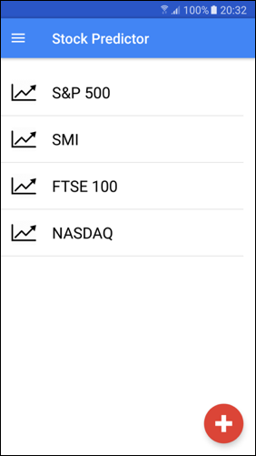
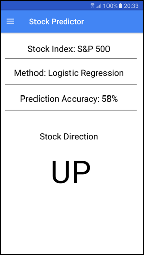

# StockPredictorView

The StockPredictorView is an Android app to request the stock index direction.

## View
The Android app has two views. In the first one the user can click on a stock index which triggers a job in a Databricks cluster and the second view shows the result.

  
  

## Dataset
Currently, this only works with the S&P 500 dataset from 2001 to 2005 but the idea is that with access to real time stock quotes smartphone apps could help users buy or sell stocks more effectively.

