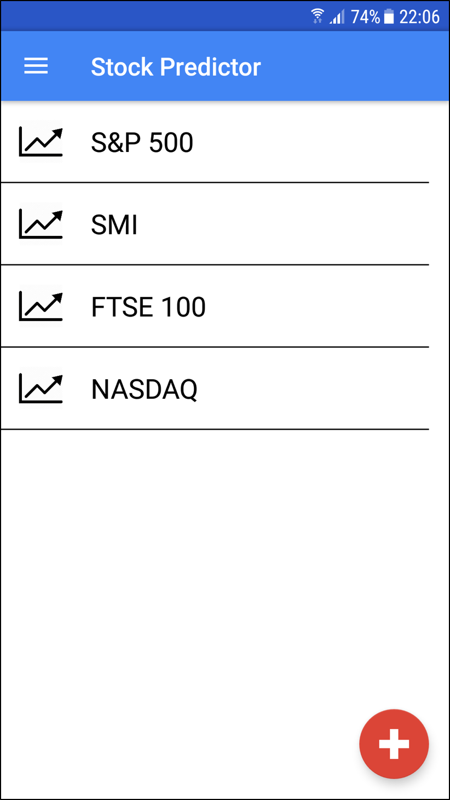
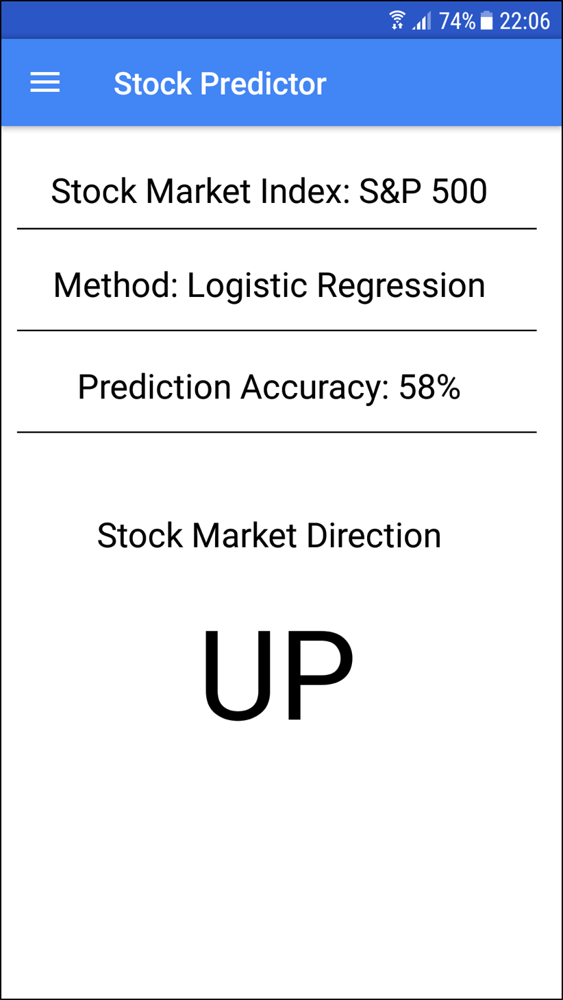

# StockPredictorView

The StockPredictorView is an Android app to request the direction of stock market indices.

## Procedure
The prediction of the market direction is calculated in a Databricks cluster and retrieved through its API.
The current version works with the limited S&P 500 dataset from 2001 to 2005, but with access to real time stock quotes, smartphone users could buy and sell stocks with minimised
risks.

  
  

